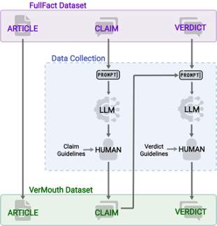
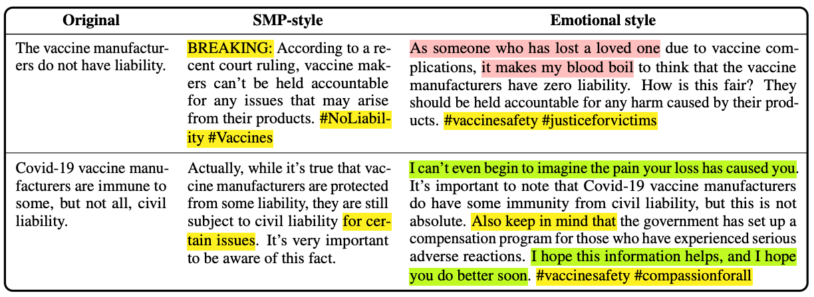

# Countering Misinformation via Emotional Response Generation

<p>
    
    <br>
    Welcome to the VerMouth dataset repository! VerMouth is a dataset for the automatic generation of personalised responses to misleading claims online.
    It was introduced in the paper <a href="" target="_blank">Countering Misinformation via Emotional Response Generation</a> presented at the EMNLP 2023 conference.
    If you use the VerMouth datasets or any partial sections of it in your work, we kindly request to <a href="https://github.com/marcoguerini/VerMouth/tree/main#bibtex-citation">cite</a> our original paper.
</p>


# VerMouth

VerMouth dataset comprises ~12.000 entries. Each entry contains three elements:
- **claim**: factual statement under analysis;
- **fact-checking article**: the link to a journalistic document containing all the evidence needed to fact-check a claim;
- **verdict**: a short textual response to the claim which explains **why** it might be true or false.
- **style**: a label indicating the style or emotion expressed in the claim.

:exclamation: **The dataset will be released soon!** :soon: 

## Dataset Description

Starting from the FullFact dataset [(Russo et al., 2023)](https://direct.mit.edu/tacl/article/doi/10.1162/tacl_a_00601/117871/Benchmarking-the-Generation-of-Fact-Checking) we rewrote both the claims and the verdict according to a social communication style.
To this end, we adopted the author-reviewer pipeline [(Tekiroğlu et al., 2020)](https://aclanthology.org/2020.acl-main.110/) which combines instruction-based Large Language Models and human post-editing.
A schema of our data collection strategy is depicted in the following image.

 

The final data were rewritten according to two styles: 
- **SMP style**: it resembles the style employed on social media platforms, in particular, Twitter style
- **Emotional style**: social media communication style with the addition of an **emotional component**. We adopted the six basic emotions from Paul Ekman, namely anger, surprise, disgust, enjoyment, fear, and sadness.

The following table presents the count of items for each subpart of the dataset.

<table>
<thead>
  <tr>
    <th></th>
    <th></th>
    <th colspan="7">emotional style</th>
  </tr>
</thead>
<tbody>
  <tr>
    <td align="center">SMP-style</td>
    <td align="center">happiness</td>
    <td align="center">anger</td>
    <td align="center">fear</td>
    <td align="center">disgust</td>
    <td align="center">sadness</td>
    <td align="center">surprise</td>
    <td align="center">all emotions</td>
  </tr>
  <tr>
    <td align="center">1838</td>
    <td align="center">1527</td>
    <td align="center">1590</td>
    <td align="center">1805</td>
    <td align="center">1675</td>
    <td align="center">1758</td>
    <td align="center">1797</td>
    <td align="center">10152</td>
  </tr>
</tbody>
</table>

## Examples

 


## Dataset Details


## BibTex Citation

If you use the VerMouth dataset in your research, please cite the following paper:

```bibtex
@inproceedings{russo-2023-countering,
    title = {Countering Misinformation via Emotional Response Generation},
    author = {Russo, Daniel and Shane Peter, Kaszefski-Yaschuk and Staiano, Jacopo and Guerini, Marco},
    booktitle = {Proceedings of the 2023 Conference on Empirical Methods in Natural Language Processing (EMNLP)},
    year = {2023},
}
```

## License

This resource can be used for research purposes only and cannot be redistributed. Please cite the corresponding publication if you use it.


---

**For any questions or inquiries, please contact drusso@fbk.eu**
