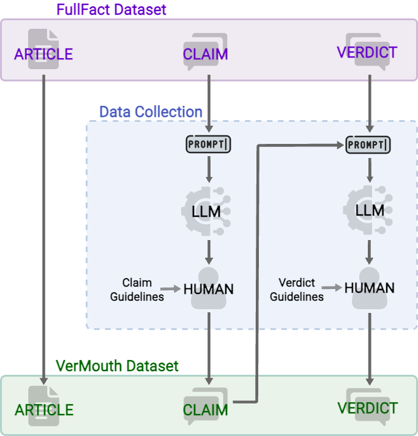

# Countering Misinformation via Emotional Response Generation

Welcome to the VerMouth dataset repository! VerMouth is a dataset for the automatic generation of personalised responses to misleading claims online.
It was introduced in the paper [**Countering Misinformation via Emotional Response Generation**]() presented at the EMNLP 2023 conference.
If you use the VerMouth datasets or any partial sections of it in your work, we kindly request to [cite](https://github.com/marcoguerini/VerMouth/tree/main#bibtex-citation) our original paper.

<div align="center">
    
</div>


# VerMouth
Vermouth dataset comprises ~12.000 entries. Each entry contains three elements:
- **claim**: factual statement under analysis;
- **fact-checking article**: the link to a journalistic document containing all the evidence needed to fact-check a claim;
- **verdict**: a short textual response to the claim which explains **why** it might be true or false.
- **style**: a label indicating the style or emotion expressed in the claim.


:exclamation: **The dataset will be released soon!** :soon: 

## Dataset Description

Starting from the FullFact dataset [(Russo et al., 2023)](https://direct.mit.edu/tacl/article/doi/10.1162/tacl_a_00601/117871/Benchmarking-the-Generation-of-Fact-Checking) we rewrote both the claims and the verdict according to a social communication style.
To this end, we adopted the author-reviewer pipeline [(Tekiroğlu et al., 2020)](https://aclanthology.org/2020.acl-main.110/) which combines instruction-based Large Language Models and human post-editing.
A schema of our data collection strategy is depicted in the following image.

 

The final data were rewritten according to two styles: 
- **SMP style**: it resembles the style employed on social media platforms, in particular, Twitter style
- **Emotional style**: social media communication style with the addition of an **emotional component**. We adopted the six basic emotions from Paul Ekman, namely anger, surprise, disgust, enjoyment, fear, and sadness.

The following table presents the count of items for each subpart of the dataset.

<table>
<thead>
  <tr>
    <th></th>
    <th></th>
    <th></th>
    <th colspan="7">emotional style</th>
  </tr>
</thead>
<tbody>
  <tr>
    <td></td>
    <td>FullFact</td>
    <td>SMP-style</td>
    <td>happiness</td>
    <td>anger</td>
    <td>fear</td>
    <td>disgust</td>
    <td>sadness</td>
    <td>surprise</td>
    <td>all emotions</td>
  </tr>
  <tr>
    <td>COUNT</td>
    <td>1838</td>
    <td>1838</td>
    <td>1527</td>
    <td>1590</td>
    <td>1805</td>
    <td>1675</td>
    <td>1758</td>
    <td>1797</td>
    <td>10152</td>
  </tr>
</tbody>
</table>

The following table shows the average length of claims and verdicts in the FullFact and VerMouth (SMP and emotional styles) datasets.

<table>
<thead>
  <tr>
    <th></th>
    <th colspan="2">FullFact</th>
    <th colspan="2">SMP-Style</th>
    <th colspan="2">Emotional Style</th>
  </tr>
</thead>
<tbody>
  <tr>
    <td></td>
    <td>claim</td>
    <td>verdict</td>
    <td>claim</td>
    <td>verdict</td>
    <td>claim</td>
    <td>verdict</td>
  </tr>
  <tr>
    <td>Tokens</td>
    <td>18.0</td>
    <td>35.5</td>
    <td>34.1</td>
    <td>52.3</td>
    <td>52.8</td>
    <td>61.3</td>
  </tr>
  <tr>
    <td>Words</td>
    <td>16.5</td>
    <td>33.7</td>
    <td>29.1</td>
    <td>51.0</td>
    <td>47.5</td>
    <td>57.6</td>
  </tr>
  <tr>
    <td>Sentences</td>
    <td>1.0</td>
    <td>1.9</td>
    <td>2.6</td>
    <td>2.5</td>
    <td>3.4</td>
    <td>3.0</td>
  </tr>
</tbody>
</table>

## Examples

 


## Dataset Details


## BibTex Citation

If you use the VerMouth dataset in your research, please cite the following paper:

```bibtex
@inproceedings{russo-2023-countering,
    title = {Countering Misinformation via Emotional Response Generation},
    author = {Russo, Daniel and Shane Peter, Kaszefski-Yaschuk and Staiano, Jacopo and Guerini, Marco},
    booktitle = {Proceedings of the 2023 Conference on Empirical Methods in Natural Language Processing (EMNLP)},
    year = {2023},
}
```

## License

This resource can be used for research purposes only and cannot be redistributed. Please cite the corresponding publication if you use it.


---

**For any questions or inquiries, please contact drusso@fbk.eu**
